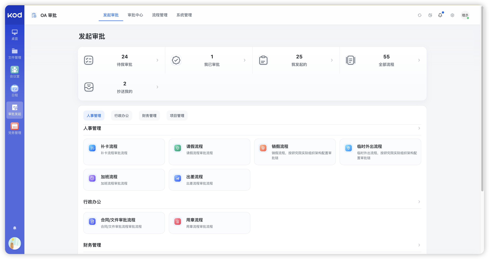
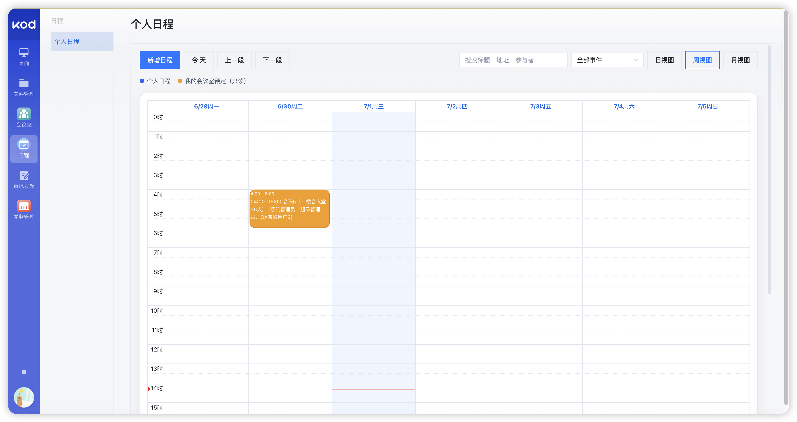
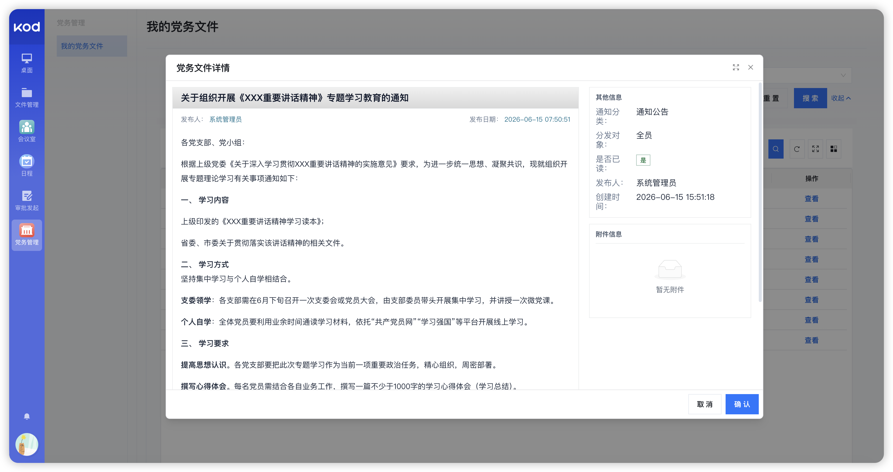
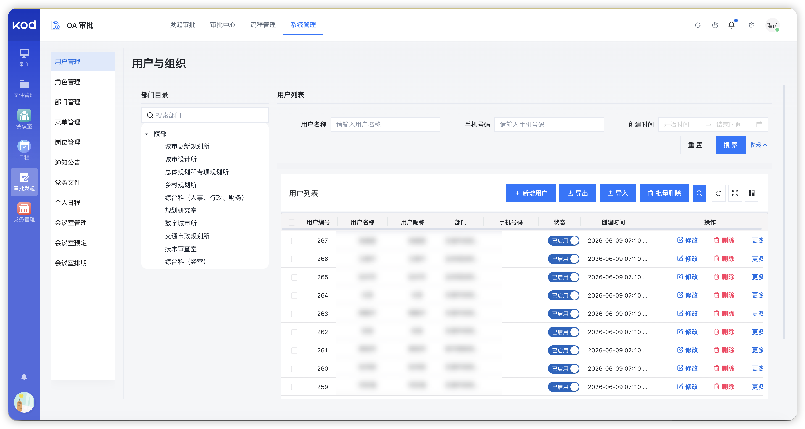
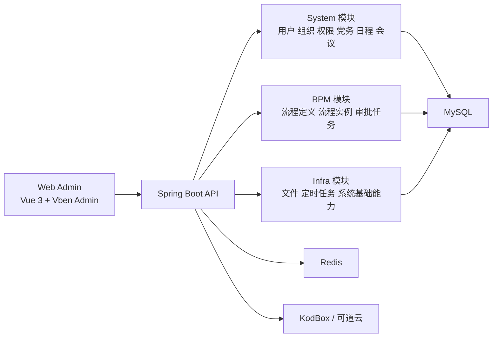

# 🚀 KodBox OA 协同审批平台

<div align="center">


一个围绕 **审批协同、组织管理、会议预约、个人日程、党务文件** 打造的企业 OA 平台。  
基于 `RuoYi-Vue-Pro` 深度定制，并完成了与 **可道云（KodBox）** 的集成联动。

</div>

---

## ✨ 项目亮点

- 🔐 **可道云登录接入**：支持与 KodBox 统一登录联动，减少多系统重复登录成本
- 🏢 **组织树协同**：用户、部门、角色围绕真实组织结构管理，便于后续审批链与权限控制
- 🧩 **审批流引擎集成**：基于 BPM 能力承载请假、出差、合同、用章等业务审批
- 📅 **协同办公能力**：支持个人日程、会议室预约、会议安排等日常办公场景
- 📢 **党务文件管理**：支持发布、阅读跟踪、附件处理、定向分发等党务通知能力
- 🐳 **环境解耦部署**：支持 `dev / stage / prod` 多环境配置拆分，适合持续交付
- ⚙️ **自动化交付链路**：支持通过 GitHub Actions 执行构建与部署流程

---

## 🖼️ 预览效果

### 发起审批



### 周视图日程 / 会议室预约联动



### 党务文件详情



### 用户与组织管理



---

## 🧱 核心能力

### 1. 审批中心

- 发起审批、待我审批、我已审批、我发起的、抄送我的
- 支持按业务分类组织审批模板
- 适配人事、行政、财务、项目等典型流程场景

### 2. 用户与组织

- 用户、角色、部门、岗位、菜单一体化管理
- 支持树形组织结构展示与权限控制
- 支撑审批候选人、数据权限、通知分发等上层能力

### 3. 会议与日程

- 会议室管理、会议室预约、会议安排
- 个人日程与会议室预约数据协同展示
- 支持日 / 周 / 月多视图查看

### 4. 党务文件

- 党务通知发布、详情阅读、阅读状态跟踪
- 定向分发到指定组织或人员范围
- 支持附件上传、预览、下载与记录追踪
- 支持与可道云目录联动的文件管理能力

### 5. 可道云集成

- 可道云 SSO 登录接入
- 可道云目录来源配置
- 文件目录读取、附件上传、文件预览/下载联动
- 支持服务账号模式自动换取访问令牌

---

## 🏗️ 架构设计



### 后端分层

- `yudao-server`：应用启动入口与统一装配
- `yudao-module-system`：系统管理、组织权限、党务文件、日程、会议室等核心业务
- `yudao-module-bpm`：流程定义、审批任务、流程实例等工作流能力
- `yudao-module-infra`：文件、代码生成、监控等基础设施能力
- `yudao-framework`：安全、Web、MyBatis、租户、数据权限等通用框架层

### 前端分层

- `yudao-ui/yudao-ui-admin-vben-temp`：基于 Vue 3 + TypeScript + Vite + Vben 的管理后台
- 按模块组织路由、页面、API、表单 schema、权限控制逻辑

---

## 🛠️ 技术栈

### 后端

- Java 8+
- Spring Boot 2.7.x
- Spring Security
- MyBatis-Plus
- Redis
- Maven

### 前端

- Vue 3
- TypeScript
- Vite
- Vben Admin
- Ant Design Vue
- Pinia
- FullCalendar

### 工作流与集成

- Flowable / BPM
- KodBox / 可道云
- Docker / Docker Compose
- GitHub Actions

---

## 📂 项目结构

```text
.
├── yudao-server/                # Spring Boot 启动入口
├── yudao-framework/             # 通用框架层
├── yudao-module-system/         # 系统管理 / 党务 / 日程 / 会议等业务
├── yudao-module-infra/          # 基础设施能力
├── yudao-module-bpm/            # BPM 工作流模块
├── yudao-ui/
│   └── yudao-ui-admin-vben-temp/# 管理后台前端
├── script/
│   └── docker/                  # Docker 构建与部署脚本
├── sql/                         # 数据库脚本
├── docs/                        # 项目文档与预览资源
└── .github/workflows/           # CI/CD 工作流
```

---

## 🚀 本地开发

> 以下仅展示通用流程，不包含任何真实服务器、数据库、账号或部署密钥。

### 1. 后端启动

```bash
mvn clean package -DskipTests
```

按项目实际环境准备数据库、Redis 与应用配置后，启动 `yudao-server`。

### 2. 前端启动

```bash
cd yudao-ui/yudao-ui-admin-vben-temp/apps/web-antd
pnpm install
pnpm dev
```

---

## 🐳 部署说明

项目已按多环境方式拆分部署配置，适合开发、测试、生产分层管理。

### 环境建议

- `dev`：本地开发联调
- `stage`：生产前验证 / 业务测试环境
- `prod`：正式生产环境

### 部署特点

- 支持 Docker 镜像构建与远程加载
- 支持前后端分离部署
- 支持环境变量外置，不在仓库中暴露敏感配置
- 支持自动清理旧镜像与构建缓存

### 相关目录

- `script/docker/`：Dockerfile、Compose、远程部署脚本
- `script/docker/env/`：环境变量模板
- `.github/workflows/`：自动化部署工作流

---

## 🔄 CI / CD

当前仓库支持将部署流程接入 GitHub Actions，适用于：

- push 到指定分支后自动构建
- 根据环境变量文件生成目标环境配置
- 执行镜像构建、上传、远程重载
- 将 `stage / prod` 的部署链路分开管理

建议实践：

- 将账号、密钥、主机、端口等全部放入 GitHub Secrets
- 将环境变量模板与实际值解耦
- 将数据库导入、镜像清理、容器重载作为标准步骤固化

---

## 🔐 安全说明

- 仓库中**不应提交**任何真实服务器地址、数据库密码、访问令牌、服务账号密码
- 第三方系统接入建议采用环境变量或密钥管理方式注入
- 对外展示文档仅保留架构与流程，不暴露真实内网/公网信息

---

## 🗺️ 后续规划

- [ ] 完善更多审批模板与审批链编排
- [ ] 强化可道云组织与账号同步能力
- [ ] 增强党务文件的日志审计与统计分析
- [ ] 补充更完整的自动化测试与交付流水线
- [ ] 优化多环境配置治理与回滚机制

---

## 📬 联系方式

- 📧 邮箱：`zhaoyongze2023@gmail.com`
- 💬 微信：`zhaoyongze_641`

---

## 🙏 致谢

本项目基于开源生态进行定制与扩展，感谢以下技术基础与社区支持：

- [RuoYi-Vue-Pro](https://github.com/YunaiV/ruoyi-vue-pro)
- [Vue Vben Admin](https://github.com/vbenjs/vue-vben-admin)
- [KodBox / 可道云](https://kodcloud.com/)
